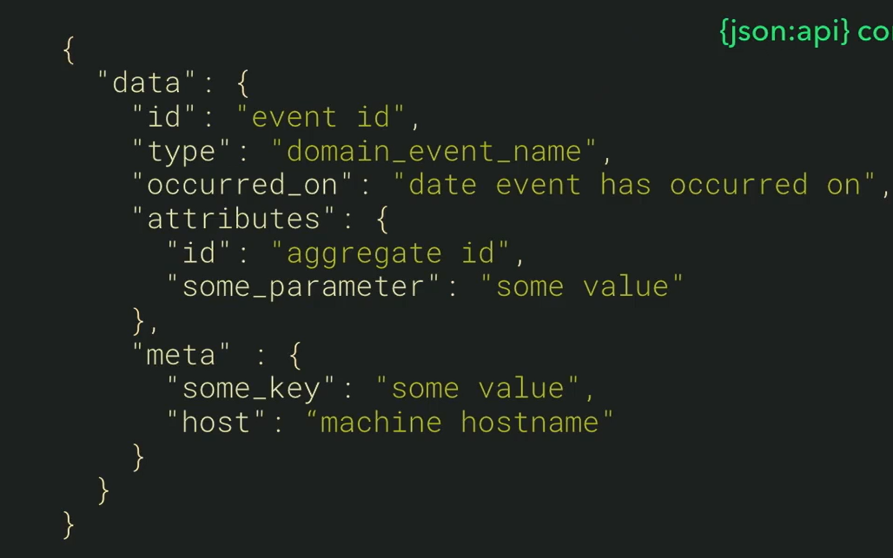

# Solucion: Eventos de dominio

uno llama al otro
- La ventaja de esto es que evitamos los JOINS
- Un usuario tiene muchos videos
- Evitamos consultas muy complicadas y simplemente guardamos llaves forraneas de cada uno
- Reducimos latencias a 0 (no caching) y evitamos efecto dominio sin CB
- Escalabilidad implementacion (consumidores No condicionan DEficion, OCP)
- El video Creado no define una accion necesario del usuario y la accion de creacion de videos esta abierto a extension y cerrado a modificacion
- Reactive Manifesto certified
## Nuevos conjustos de problemas
- Consistencia eventual, baja consistencia
- Mantener distintas representaciones de la misma informacion (proyeccion)
- Gestionar eventos depublicados
- gestionar eventos desordenados
- implicaciones a nivel de testing
## Como Definir la estructura de nuestrso eventos de dominio
