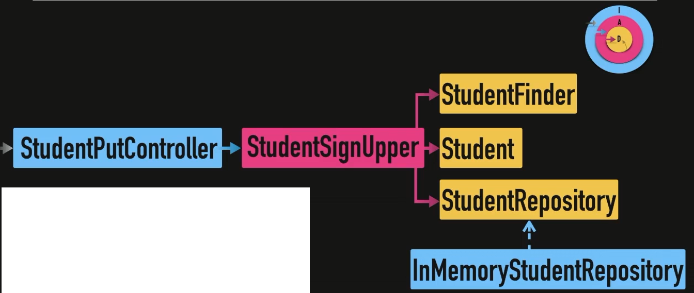

# Flujo peticion en arquitectura hexagonal

- Infrastructure
- Application (representa los casos de uso)
- Domain (modeloado del negocio, Value Objects, Entities)

> Controller(Infraesctuture) -> Application Service(Aplicattion) -> Services (Domain) | Models(Domain) | Repos <-- Implementation

