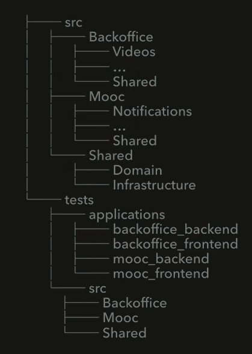

# Promoviendo un modulo a Bounded Context

CUando empezamos a tener muchos Modulos adentro de BackOffice O Mooc
o un modulo Empieza a crecer demasiado creamos un boundex Context
- src
    - BackOffice
    - Mooc
    - Notifications
        - Email
        - Push
        - ...
    - Shared
        - Domain
        - Infraestructure

En el Boundex Context tiene como modulo **Notifications** Email y puish porque tiene sentido y relacion entre el email
