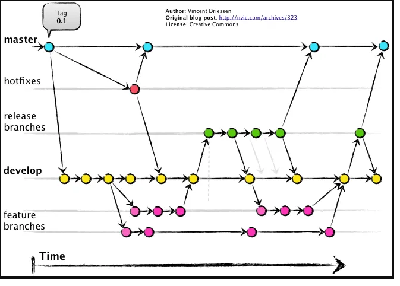
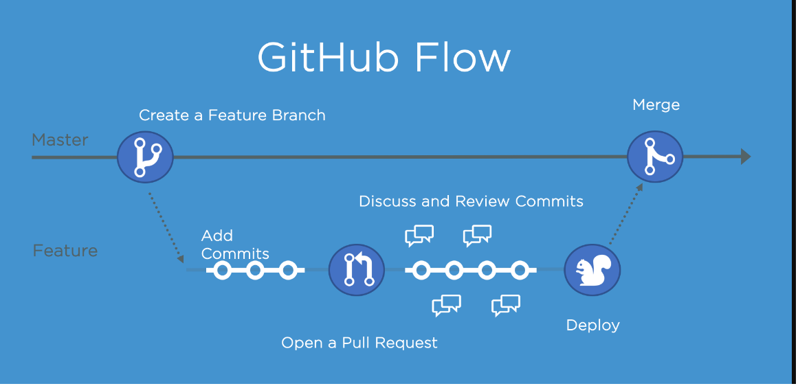
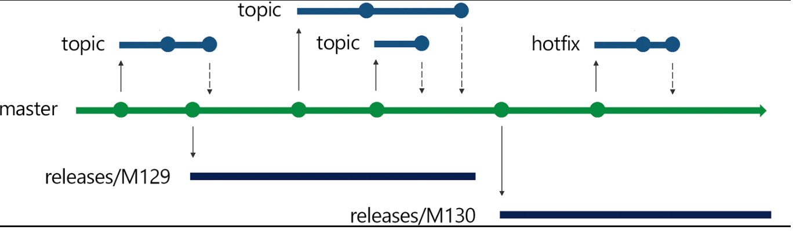

# Flujos de trabajos de github
##  Git flow

- Develop + master + Feature ranch + Release branch + hotfix branch
    - De vez en cuando develop se integra en master
    - Normalmente Master = Produccion
    - El historico (muy) queda sucio
    - CD un poco complicado
## GitHub Flow: El modelo Open Source

- Master siempre es deployable y con mucha confianza
- Bien con el CD
- Historico limpio
- El deploy son las feature branch
- El pre-pro son las feature branch
- Solo de hace deploy de una feature
- En termino de agile podmeos entregar valor mas continua
- La resisencia al cambio es mucho menor
## Realease Flow: Microsfot git 

- Cuando tengas muchas pull request al dia
- Cuando son muchas personas
- se hace deploy cada cierto tiempo y no esperar 3 semanas cuando termine un ciclo
- siempre se deployasn relase branches
- si hay un fallo se hace rama hotfix y cherry-pic de los cambios
- luego se llevan tambien a lñas release branches
- una release por sprint
## Trunk-Based development: CUando los nombres engañan

- Muy similar a gitflow
- tenemos una release brnach para las situaciones donde tardamos varios dias en lanzar una produccion
- Puede tener release branches
- Puede tener tags
- Master siempre deployable

