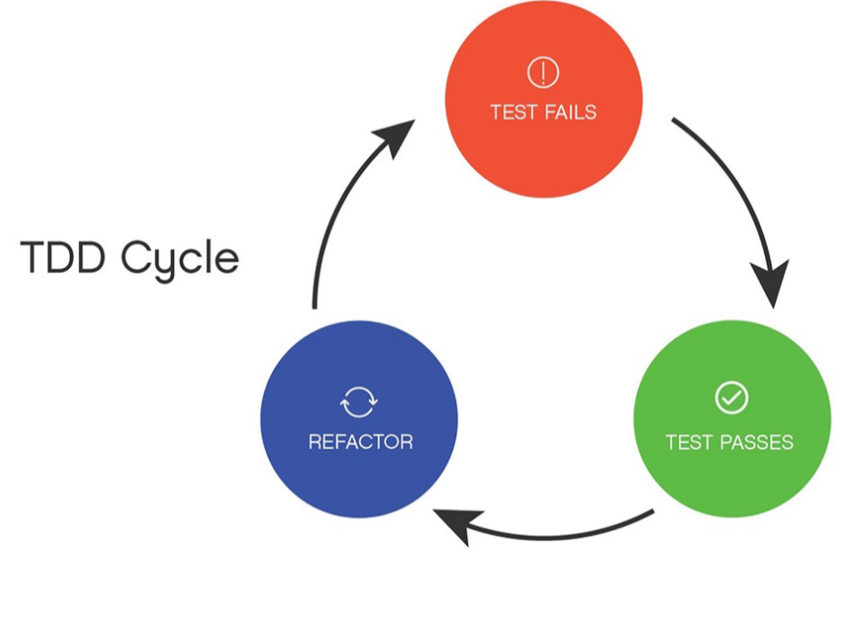

# Introduccion a TDD
TDD Cycle

## Manifiesto de buenos hábitos de TDD

#### (Principios)
- las pruebas deben probar una sola cosa
	- probar una aserción lógica
	- no mezclar aserciones de estado y de colaboración en la misma prueba
	- las modificaciones del código de producción sólo deben romper los casos de prueba relacionados
- cada prueba debe ser autónoma, incluidos los datos
- asegúrese de que las pruebas sean independientes entre sí
- no refactorizar con una prueba fallida
- organice sus proyectos de pruebas unitarias de forma que reflejen su código de producción
- mantenga separadas las pruebas y el código de producción
	- no utilice datos y código de producción para probar el código de producción
- si sus pruebas son difíciles de escribir o mantener, considere la posibilidad de cambiar el diseño

#### (fase roja)
- crear pruebas más específicas para impulsar una solución más genérica (triangular)
- dar a sus pruebas nombres significativos (orientados al comportamiento/objetivo) que reflejen su sistema de producción
- escriba primero la aserción y trabaje hacia atrás
- ver que la prueba falla por la razón correcta
- asegúrese de que las pruebas que fallan le aportan información significativa
- Organice su prueba en bloques Arrange, Act y Assert
	- Organizar (también conocido como Given) - todas las precondiciones y entradas necesarias.
	- Actuar (también conocido como "cuando"): sobre el objeto o el método que se está probando.
	- Afirmar (también conocido como "entonces"): que se han producido los resultados esperados.

#### (fase verde)
- escribir el código más sencillo para pasar la prueba
	- escriba cualquier código que le permita llegar más rápido a la fase de refactorización
	- está bien escribir cualquier código que pueda mejorar en una fase posterior
- considera el uso de premisas de prioridad de transformación para evolucionar tu código

#### (fase de refactorización)
- refactorizar de forma agresiva y constante
- tratar las pruebas como código de primera clase
- utilice el IDE para refactorizar de forma rápida y segura
- refactorizar el código de producción y de pruebas de forma independiente (excepto si se cambian las interfaces públicas)
- Utilizar la Regla de los 3 para hacer frente a la duplicación
	- El código puede copiarse una vez, pero cuando el mismo código se utiliza tres veces, debe ser refactorizado/extraído
- Recuerde que la duplicación es más barata que las abstracciones erróneas