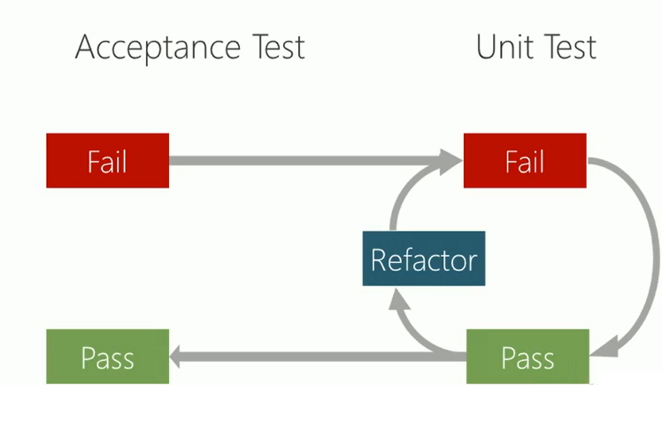

# iNtroduccion a ATDD

## Conveciones a nivel de equipo: Githooks
- No feraztorizar con los tests fallando
- No realaizar commit con los tests fallando
- Mantendras el codigo de produccion y de tests separados
## Como promuevo que se haga testing en la empresa
aveces alguna empresas no estan trabajando con el testing
- si vas con la premisa si hago mas lento si hacemos lo mismo en produccion
- entregaremos mucho mas calidad, mas estable, menos fallo, allar errores, mas facil encontrar los errores
- asumir los conceptos pocos a pocos para ir conociendo poco a poco A,B,C
- Cuando programados sin tests el software es debil, muy critica, muy fragil
- entender el rol QA como importante y despreciarlo
- Entender 1 QA por 3 desarrolladores recomendable
- Es un desarrollo a largo plazo
- Dependiento de un one shot como desarrollar un pagina en wordpress para un dia especial que cambiara el color